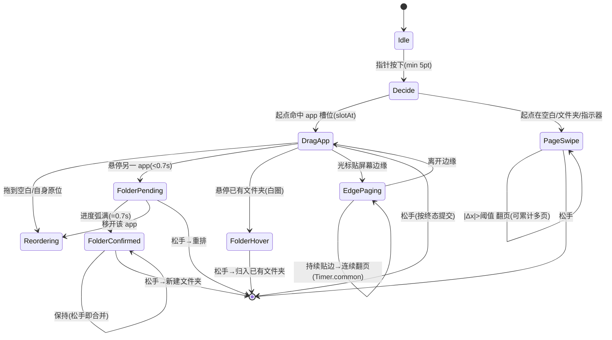

# AppLaunchpad 启动台功能梳理与技术实现方案

> 目标：当前启动台经过多轮增量修改，交互边界变模糊（拖拽/翻页/建文件夹三套手势互相牵扯）。
> 本文把**全部主要功能**重新梳理成一份干净的规格，重点拆解你提的 3 件事，并给出**统一手势仲裁**这一核心解法与分阶段实施路线。
> 所有结论均对照当前代码（`LaunchpadView.swift` / `LaunchpadViewModel.swift` / `GridPageView.swift` / `DragState.swift` / `LaunchpadWindowController.swift`）。

---

## 一、功能全景图（按模块分组，标注现状）

| 模块 | 功能 | 现状 |
|------|------|------|
| **唤起 / 窗口** | 全局热键唤起（Carbon `RegisterEventHotKey`） | ✅ 已实现 |
| | 状态栏菜单 / Dock 右键唤起 | ✅ 已实现 |
| | 全屏 `NSPanel` 浮层（`LaunchpadWindowController`） | ✅ 已实现 |
| | 设置窗口（`openWindow(id:)`），打开时降层级 | ✅ 已实现 |
| | 多显示器跟随（主屏 / 鼠标屏） | ✅ 已实现 |
| **浏览 / 分页** | 鼠标拖拽横滑翻页（`pagingDragGesture`） | ✅ 已实现 |
| | 触控板横滑 / 物理滚轮翻页（`scrollMonitor`） | ✅ 已实现 |
| | 分页指示器点击跳页（`PageIndicatorView`） | ✅ 已实现 |
| | 搜索态 / 拖拽态下屏蔽翻页 | ⚠️ 搜索态已屏蔽，拖拽态未屏蔽 |
| **拖拽 / 重排** | app 拖拽移动（单页重排） | ✅ 已实现（含实时让位弹簧） |
| | 跨页拖拽 + 边缘连续翻页（`edgeScrollTimer` `.common`） | ✅ 已实现 |
| | 拖拽起点判定（`slotAt` 命中 app 才启动） | ✅ 已实现 |
| **文件夹** | 拖 app→app 悬停 0.7s 创建文件夹（蓝圈即时 + 进度弧） | ✅ 已实现 |
| | 拖 app→已有文件夹高亮并归入（`folderHoverID`） | ✅ 已实现 |
| | 文件夹缩略图 / 打开浮层 / 重命名 / 拖出 / 解散 | ✅ 已实现 |
| **搜索** | 模糊搜索（`FuzzySearch.swift`：缩写/子序列/包含打分） | ✅ 已实现 |
| | 搜索结果网格 / 键盘输入 / 点背景清空 | ✅ 基本可用 |
| **编辑 / 删除** | 长按进编辑、点背景退出 | ✅ 已实现 |
| | 网格内删除 X（编辑态抖动） | ❌ 已移除（`WobbleModifier` 保留未用） |
| **外观 / 设置** | 列/行/图标尺寸/间距/透明度/背景实时滑杆 | ✅ 已实现 |
| | 弹入 / 让位 / 翻页动画 | ✅ 已实现 |
| **数据 / 持久化** | `NSWorkspace` 扫描 + `LayoutStore`(JSON) + `UserPreferences`(UserDefaults) | ✅ 已实现 |
| | 原生 Launchpad 布局导入 | ⏳ 未做（P0 待办） |

**结论：你提的 3 件事都已"能用"，但边界不清晰 → 感觉乱。** 下文给出让它们边界分明的方案。

---

## 二、重点功能 1：拖拽移动 + 分页 + 连续分页

### 当前实现
- 拖拽手势宿主在 `LaunchpadView` 根视图 `globalDragGesture`（`DragGesture(minimumDistance:5)`），起点用 `slotAt` 判定是否落在 app 上，只有命中 app 才 `beginDrag` 并 `enterEditMode`（`LaunchpadView.swift:218`）。
- 拖拽中 `updateDragTarget(nearestSlot)` → `pageItemsWithDrag` 把被拖图标插入目标槽位，周围图标 `.spring` 让位。
- 跨页：拖到屏幕左/右边缘 0.4s 内启动 `edgeScrollTimer`（`Timer` 加 `.common`，否则拖拽中 RunLoop 切 `NSEventTrackingRunLoopMode` 不 fire），每隔一拍 `flipPageWhileDragging`（`LaunchpadViewModel.swift:267`）。**这就是"连续分页"**，已具备——只要光标持续贴边就会一直翻。
- 落点：`endDrag` 用 `nearestSlot(to:dragLocation)` 实时重算，跨页快照失效时 `nearestSlot` 自动刷新 `dragSlotFrames` 为当前页几何。

### 待修的不清晰点
1. **翻页阈值一次性**：纯滑动翻页（`pagingDragGesture`）一次手势只翻一页；想连翻需多次拖。建议"连续分页"在**滑动**场景也支持：累计位移超 `pageWidth` 即翻多页（见第五节统一方案）。
2. **拖拽中滚轮翻页未屏蔽**：`scrollMonitor`（`LaunchpadWindowController.swift:193`）没有 `!viewModel.dragState.isDragging` 守卫，拖拽时滚触控板会额外翻页、干扰落点 → 必改。
3. **边界 5–30pt 死区**：`globalDragGesture`(5) 与 `pagingDragGesture`(30) 同层 `simultaneousGesture`，空白区域 5–30pt 之间既不会进拖拽也不会翻页，手感发"涩"。

### 方案
- 保留 `edgeScrollTimer` 连续翻页机制（已正确），仅把"贴边判定"从固定 0.4s 改为**进入边缘带即启动、离开即停**（更跟手）。
- `scrollMonitor` 加 `!viewModel.dragState.isDragging` 守卫（见冲突 C3）。
- 死区问题随第五节"单手势仲裁"一并消除。

---

## 三、重点功能 2：拖拽创建文件夹

### 当前实现（交互模型）
- 拖一个 app 悬停到**另一个 app** 上 → `updateDragTarget` 命中 `.app` 且 `≠ draggedBundleID` 时立即设 `folderCandidateID`，`GridPageView` 即时画**完整蓝圈 + 1.12 缩放**（已按你要求改为悬停即出现），并启动 0.7s 进度计时器。
- 进度满 → `folderTargetID` 置位 → **松手**时 `endDrag` 识别 `isFolderMode`/`folderTargetID` → `createFolder(被拖, 目标)` 生成新文件夹（缩略图取两 app 拼 3×3）。
- 拖到**已有文件夹**上 → 设 `folderHoverID` → 即时白环高亮 → 松手 `addAppToFolder`。

### 不清晰点（核心痛点）
**"拖到 app 上"同时是两种操作：短停=重排落点，长停 0.7s=建文件夹。** 当前没有任何"已进入建文件夹待确认"的强反馈，用户分不清自己松手会重排还是建文件夹。你之前要求蓝圈即时出现，已解决"标识可见性"，但**0.7s 后的"提交边界"仍不够明确**。

### 方案（让建文件夹意图一眼可辨）
1. **三态视觉**：
   - 悬停 < 0.7s：蓝圈（标识"将创建"）+ 图标轻微上浮，但**不锁定**。
   - 进度弧满（= 0.7s）：蓝圈变**实心描边 + 两图标轻微聚拢动画**，明确"松手即合并"。
   - 松手在 ≥0.7s 态 → 建文件夹；<0.7s → 仅重排。
2. **可中途取消**：0.7s 内把光标移开该 app → 进度清零、回到重排态（当前"同 app 不重置计时器"防护已支持，但移开到空白应仍清零，需确认 `slotIndex != prevSlot` 分支对"移回被拖 app 原位"也清零）。
3. 与"拖到已有文件夹"用**不同颜色**（白=归入已有，蓝=新建），杜绝混淆。

> 关键：建文件夹与重排的**唯一区别就是"悬停时长"**，必须在视觉上把"待确认/已确认"两态拉开，这是消除"乱"的重点。

---

## 四、重点功能 3：鼠标滑动分页

### 当前实现
- **机制 A（鼠标拖拽）**：背景层 `Color.clear` 上的 `pagingDragGesture`（`DragGesture(minimumDistance:30)`，仅横向 `|Δx|>|Δy|`），位移超 50pt 翻一页（`LaunchpadView.swift:248`）。
- **机制 B（触控板/滚轮）**：`LaunchpadWindowController.scrollMonitor`（`NSEvent` 本地 `scrollWheel` 监视器）。触控板按 `phase` 累积 `scrollingDeltaX`，`.ended` 时水平主导且幅度 >20pt 翻页；物理滚轮每步直接响应（`LaunchpadWindowController.swift:193`）。
- 二者都调用 `goToNextPage/goToPreviousPage`，配 `.spring` 翻页动画。

### 不清晰点
- 两个独立入口**无统一仲裁**：触控板滑动 + 鼠标拖拽同时发生时各翻各的；且机制 A 与机制 C（app 拖拽）同层竞争（死区问题）。
- "鼠标滑动"若指**鼠标横向滚轮**，机制 B 已支持；若指**按住鼠标左键拖空白**，机制 A 已支持。两者并存但用户感知不到区别，显得"有两套翻页"。

### 方案
- 把"翻页"收敛为**单一入口**：保留 `scrollMonitor` 作为触控板/滚轮输入；把"鼠标拖空白翻页"并入第五节**统一手势仲裁**（不再有独立的 `pagingDragGesture`）。
- `scrollMonitor` 补 `!viewModel.isEditMode && expandedFolder==nil && !dragState.isDragging` 守卫（与拖拽/编辑态互斥）。

---

## 五、核心解法：统一手势仲裁（消除"乱"的关键）

把当前"三套并存的拖拽/翻页手势"收敛为**一个状态机**，从`按下瞬间`就根据**起点位置 + 首段位移方向**判定用户意图，后续全程走对应分支。

### 状态机（mermaid）

### 落地要点
1. **删除** `pagingDragGesture`，改由根视图**单个** `DragGesture(minimumDistance:5)` 在 `onChanged` 首帧 `decide`：
   - `slotAt(startLocation)` 命中 app → `mode=.dragApp`，调 `beginDrag`。
   - 否则 → `mode=.page`，记录 `startX`，按 `translation.x` 实时偏移并累计翻页。
2. **消除死区**：因只有一个手势，5pt 后必进某一分支，不再有 30pt 门槛。
3. **拖拽分支**保留现有 `updateDragTarget` + `pageItemsWithDrag` 让位 + `edgeScrollTimer` 连续翻页。
4. **翻页分支**支持"连续分页"：累计位移每跨一个 `pageWidth` 即翻一页（滑动场景一次手势可连翻多页）。
5. **滚动翻页**（`scrollMonitor`）作为独立输入源保留，但加 `!dragState.isDragging` 守卫，与拖拽互斥。
6. **搜索态 / 编辑态 / 文件夹展开态**在 `decide` 前统一 `return`，交给各自专用交互（搜索结果点击、`exitEditMode`、文件夹内拖拽）。

---

## 六、相互影响与冲突矩阵（重点）

| 冲突 | 涉及功能 | 严重度 | 现状 / 解法 |
|------|----------|--------|------------|
| **C1** 拖拽手势 vs 翻页手势死区(5–30pt) | 拖拽 / 翻页 | 中 | 第六节统一仲裁消除 |
| **C2** 让位动画 vs 蓝圈位置偏移 | 拖拽 / 建文件夹 | 中 | `folderCandidateID` 跟 app ID + `!isDragged` 守卫已缓解；仍需"同 app 不重置计时器"防护保持 |
| **C3** 拖拽中滚轮翻页干扰落点 | 拖拽 / 翻页(滚轮) | **高** | `scrollMonitor` 补 `!dragState.isDragging`（必改） |
| **C4** 建文件夹 vs 重排 同为"拖到 app" | 建文件夹 / 重排 | 中 | 仅靠 0.7s 区分 → 用三态视觉拉开"待确认/已确认"（见第三节） |
| **C5** 搜索态背景仍响应翻页/点击 | 搜索 / 翻页 | 低 | 搜索结果单页，`pagingView` 已不渲染；可加 `isSearching` 守卫背景手势 |
| **C6** 跨页落点快照 vs 连续翻页竞争 | 拖拽跨页 | 低 | `nearestSlot` 检测 `currentPageIndex≠dragSnapshotPage` 自动刷新（已修） |
| **C7** 文件夹展开浮层 vs 拖出落点 | 文件夹 / 拖拽 | 中 | 拖出用 `dropLocation` 转全局坐标找目标页槽位（`moveAppOutOfFolder`），需验证多页正确 |
| **C8** 长按进编辑 vs 拖拽起点进编辑（双路径） | 编辑 / 拖拽 | 低 | 功能正常；统一后仅保留拖拽起点进编辑，长按仅用于文件夹内 |
| **C9** 设置窗口打开时层级 / 热键 | 窗口 / 唤起 | 低 | 已处理（`didBecomeKey` 降层级） |

> 最高优先级：**C3**（拖拽中滚轮翻页）——它直接破坏"拖到第二页"的落点，应最先修。

---

## 七、其他主要功能补充（你问"还有哪些"）

1. **唤起与窗口管理**：全局热键、状态栏、Dock、全屏浮层、设置窗口层级——已完善，无需动。
2. **搜索**：模糊搜索已上线；待优化（P2）搜索框自动聚焦、文件夹浮层内打字误触发、点背景先清空搜索。
3. **编辑模式与删除**：当前**网格内删除 X 已移除**，仅文件夹展开内能删。若想恢复"网格长按抖动 + 左上角 X 删除"，属 P1 待办。
4. **外观 / 设置**：列行/图标/间距/透明度实时生效，已完善。
5. **数据持久化**：JSON 布局 + UserDefaults 偏好，已完善；**原生 Launchpad 布局导入**是 P0 最后一项，做了可零配置迁移。
6. **多显示器**：主屏/鼠标屏跟随，已完善。

---

## 八、分阶段实施路线

| 阶段 | 内容 | 优先级 | 风险 |
|------|------|--------|------|
| **P0-修复** | C3：`scrollMonitor` 加 `!dragState.isDragging` 守卫 | 高 | 极低 |
| **P1-统一仲裁** | 删 `pagingDragGesture`，根视图单手势 `decide` 状态机；翻页支持连续多页；消除死区 | 高 | 中（需回归拖拽/翻页） |
| **P1-建文件夹三态** | 蓝圈"待确认/已确认"视觉拉开；白=归入已有、蓝=新建 | 中 | 低 |
| **P1-网格删除** | 恢复编辑态抖动 + 左上角 X（可选，按你需要） | 中 | 低 |
| **P2-搜索打磨** | 自动聚焦、文件夹内不误触、点背景清空 | 中 | 低 |
| **P0-原生导入** | 读系统 Launchpad SQLite 迁移布局 | 中 | 中（schema 兼容） |

---

## 九、验收标准（改完如何确认"不乱了"）

- [ ] 空白区横向拖 → 只翻页；app 上拖 → 只拖拽；无 5–30pt 死区。
- [ ] 拖到屏幕边缘并保持 → 连续多页翻（拖拽态不中断）。
- [ ] 拖到另一 app：蓝圈即时出现；停 0.7s 后变"已确认"态；松手建文件夹；<0.7s 松手仅重排。
- [ ] 拖到已有文件夹：白圈高亮；松手归入。
- [ ] 拖拽过程中滚触控板/滚轮 → **不再**额外翻页。
- [ ] 搜索态下：拖拽/翻页手势全部禁用，仅搜索结果点击生效。
